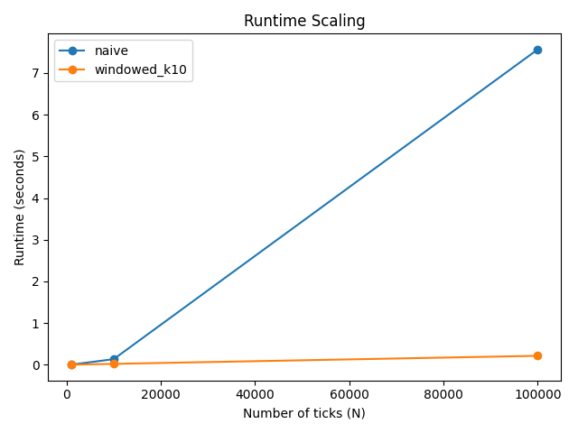
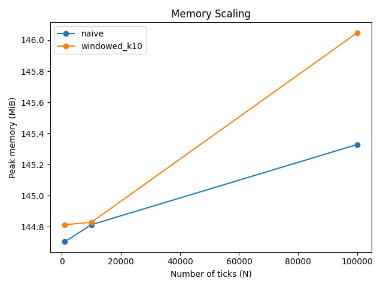

# Complexity Report

## Strategy Complexity (Theory)
- **NaiveMovingAverageStrategy**: recomputes the average from full history each tick → **O(n)** per tick and **O(N^2)** total; stores full history → **O(N)** space.
- **WindowedMovingAverageStrategy**: maintains a fixed-size window and running sum → **O(1)** per tick and **O(N)** total; stores last *k* prices → **O(k)** space.

## Key Findings
- Runtime results match the Big-O expectations; speedup summary: **35.2x faster at N=100000 (windowed_k10 vs naive)**.
- Naive runtime is dominated by repeated `sum(...)` over growing history (confirmed by cProfile).
- Windowed runtime is dominated by constant-time deque updates and arithmetic.
- The optimized moving average implementation achieves the same asymptotic efficiency as the windowed approach (O(1) per tick and O(k) space) by using incremental updates and bounded buffers, eliminating the repeated full-history summations present in the naive baseline.

## Benchmark Results
| Strategy | N ticks | Runtime (s) | Runtime / tick (µs) | Peak Memory (MiB) | Signals |
|---|---:|---:|---:|---:|---:|
| naive | 1000 | 0.003185 | 3.18 | 144.70 | 999 |
| naive | 10000 | 0.135103 | 13.51 | 144.81 | 9998 |
| naive | 100000 | 7.566363 | 75.66 | 145.33 | 99998 |
| windowed_k10 | 1000 | 0.002437 | 2.44 | 144.81 | 999 |
| windowed_k10 | 10000 | 0.021892 | 2.19 | 144.83 | 9998 |
| windowed_k10 | 100000 | 0.214898 | 2.15 | 146.05 | 99998 |

## Scaling Plots

## Measurement Notes (Memory)
- Peak memory is measured at the **process level** (Python runtime + loaded data + imported libraries), not just the strategy object.
- Therefore, absolute peak memory values may look similar across strategies even though their **asymptotic space complexity** differs (O(N) vs O(k)).

## Profiling Notes (cProfile)
- Naive hotspots are dominated by `builtins.sum`, consistent with recomputing full-history averages.
- Windowed hotspots are concentrated in constant-time deque operations and arithmetic updates.
